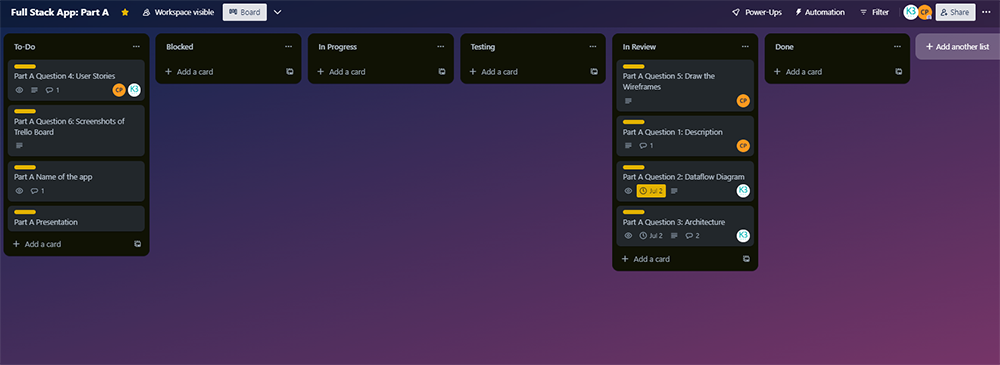

# T3A2 Full Stack App - Move Mentor

## PART A IDEATION & PLANNING
Part A involved ideation and planning. This included identifying a problem with a local business and developing a solution to meet their requirements, creating app architecture and data flow diagrams to illustrate app structure and map out the flow of information between processes, entities and data stores, developing user personas and associated user stories, designing high-fidelity wireframes and using agile planning throughout.

## Description of the app

#### Problem:

When it comes to yoga, there is a standard of move names. No matter where you are in the world, all students and teachers can identify the poses. However, when it comes to pole fitness, move names vary wildly from studio to studio (with the exception of famous moves). So transferring between studios, selecting a category for pole competitions, attending pole camps, and even remembering what was taught in class is next to impossible.

**Solution: Create a dictionary of pole moves with images and names.**

#### Target Audience:

The Move Mentor full-stack MERN app will focus on a small studio in Brisbane, CSolta Pole Studio, that has mixed level classes. The target audience will be the teacher and students of CSolta. The teacher uses her phone to search for moves to teach but there is no history of moves she has taught. Furthermore, students can't remember what they have learned and aren't able to search online because of the different move names.

#### Functionality & Features:

##### Teacher

- Login as a teacher, who is also the administrator. Note there is only one teacher at the studio.
- Search for a move and view the list of moves.
- Add a move to a class.
- Delete a move from a class.

##### Student

- Login as a student.
- Search moves.
- View moves added to their class.

##### Nice to have (time permitting)

- Allow students to mark moves as a 'favourite', and view the favourite moves under their profile.
- Add checkboxes for confidence level - a teacher can then use this information for future class planning.

#### Tech Stack: MERN

- MongoDB
- Express
- React
- React Bootstrap for styling
- Node.js

[View the Part A app presentation on Vimeo](https://vimeo.com/844095208?share=copy)

## Data flow Diagram

The Move Mentor data flow diagram maps out the flow of information between entities (students and teachers), database documents (students, teachers, classes, moves) and processes. The diagram uses Yourdon & DeMarco notation to represent entities, data stores, processes and flows (Chi 2021).

## Application Architecture Diagram

The application architecture diagram visually represents the structure of the Move Mentor app, the relationship between its components, and the flow of data. The Move Mentor app is made up of three components: a front-end, back-end and database.

Symbol representations:

- Vertical rectangle for components.
- Rounded horizontal rectangles for frameworks and languages.
- Hexagons for deployment platforms.
- Cylinders for databases.
- Arrows for data flows.

## User Stories

We decided to develop the user personas and stories together; we knew it would be a fun task using our creative brains to identify each app user's goals, motivations and frustrations, and craft stories based on these elements. This involved several conversations about the pole studio and its users:

- What does the pole studio offer?
- Who is/are the teachers? What is their experience and background?
- How do teachers structure classes?
- Who are the students? How often do they attend?
- What are the specific challenges faced at the studio, and during classes?

Following on from our discovery phase, we decided to create three users and assigned users to a specific team member. We would then review each other's work in progress and provide feedback and suggestions on how to improve outputs.

The first user story focused on the teacher and what they would need from Move Mentor. Rafaela is the studio owner and main teacher at CSolta pole studio. She uses her phone to search for moves during class time. While this process doesn't take up a lot of class time, it does come across as slightly disorganised. It's also safe to assume that she spends a lot of time outside of class researching appropriate moves for different classes with varying student abilities.

Karla interviewed Corina about what it's like to be a pole teacher including lesson planning and compared it to what Rafaela is currently doing. Through the discovery process and after several iterations, Karla developed a user persona and three story points from the perspective of a teacher. Below is the card we used for the Teacher Story.

**Teacher:**

Next came two different types of students: casual and dedicated. A casual student comes to class to have fun in a supportive social environment, while a dedicated student usually attends classes several times a week, researches new moves to try, and cares about technique.

**Casual Student:**

Karla took on the challenge of creating a casual student persona. Thinking from the mindset of a working mum with little time to pursue leisure activities, some goals, motivations and frustrations were identified. From there, three casual student stories were developed.

**Dedicated Student:**

Corina created a persona for the dedicated student. This wasn't too much of a challenge as she used to be one but there was a challenge of making the user stories short and specific. With the help of Karla's pattern of other user stories, Corina was able to get her user stories to the point which could then be used as inspiration for features in the app.

By taking an approach of discovery, and trying to identify the broader goals, motivations and frustrations of each user when it comes to pole dancing, we were able to craft user stories that helped us to identify key problems that the Move Mentor app can solve.

As with other parts of the project we used agile methodology effectively to plan our workflow - an initial collaboration, then assigning team members to develop each persona, and regularly reviewing each other's work in progress. This ensured the final user personas and stories were fit for use, and could help us further develop the Move Mentor app.

## Wireframes

#### Introduction

High-fidelity wireframes were created using Figma. With the short timeframe to design, test, develop and deploy a full stack app, high-fidelity wireframes have allowed us to go beyond placeholder text and images and capture the look and feel of the Move Mentor app including content, typefaces, colours and image dimensions (Moqups 2023). We took a mobile first approach to the wireframe designs, because most users will be using the app on their mobile phone, either in class or just prior to class for preparation purposes. Corina designed the wireframes in mobile and desktop sizes, and has also created a prototype on mobile. The prototype clearly shows the app flow, from initial login or sign up, through to viewing moves, and assigning and deleting moves (for teachers). The wireframes and prototype also clearly show intended actions and functions based on a user's click of a button or link.

[View all wireframes and the prototype in Figma](https://www.figma.com/file/BlgOBHzTnKIDA6QwaSd5eT/Full-Stack-App%3A-Part-A?type=design&node-id=0%3A1&mode=design&t=gClNEHdu0sEVweO8-1)

#### Discussion

The time spent on phones vs time spent dancing. Pole fitness can be an expensive sport, with participants wanting to maximise their class time. Therefore, this app has to be functional yet minimal. Careful consideration and thoughtful planning is essential. Intended actions, simple functions, relationships between screens, spacing and content prioritisation are all at the forefront when designing this app.

As Corina explains:

Since this is an off-shoot of an original app idea, I (Corina) had to make sure that everything was out of my head and clearly set out on paper for someone else to view, understand, and develop alongside me.

Using Figma, I threw together the initial wireframe design to get the ball rolling. It was an efficient way for my teammate, Karla, to grasp the idea of what we're building. I started to get caught up with the designs and colours, charging full steam ahead. However, I remembered earlier projects where I was the designer and someone else was building from my designs. They told me:

"Look at the documentation of the framework/language we're going to be implementing and use that to do the designs. If you need a button and we're using Bootstrap, find a Bootstrap button. Or if you need a table and we're using Tailwind, find that table in their docs. These will be the Lego pieces that I'll use for building and know exactly where to look."

I take this one step further in that this means we'll be working within the limitations of the framework too. Hopefully reducing hacks or tricky workarounds to implement something that shouldn't exist while keeping customer expectations and experience at the forefront. For example, if Bootstrap React doesn't have tables; then we won't use tables in the design. That way, the customer won't ask for a feature that was in the design but was not built into the actual product. It keeps our code cleaner and delivers what was agreed upon, which is good for reputation and contractual agreements.

**Here is an updated design using Bootstrap React pieces:**

While the colours are the same, the rounded edges of the buttons are now reflective of the buttons found in React Bootstrap. Being a coder and/or designer, attention to detail is important. We're also operating on the mindset that whoever receives these designs can interpret and build them. Nothing will be left to assumption.

**Initial Wireframe Design:**

The form buttons are mostly square with minimal rounding, there is a vague description of "maybe a drop-down selector instead of text-box?"" and a guess at mobile responsiveness.

**Using Bootstrap React Documentation:**

A specific component "Form Grid" is used, buttons are rounded, and there's a dropdown button to select student classes. There's no ambiguity and all \pieces exist in the documents. However, we can take some liberties with the styling. It would be nice to have "Name:" and the name input on the same line for aesthetic reasons but this can be fiddled with a bit later. Since the studio currently doesn't have a logo or colour theme, we had the freedom to choose. As it is bright and airy inside, we went with a similar look and feel for the app.

**Student Colours:**

But, then we thought about what the teacher colours should look like so that it is distinctive from the student account but still keeps the same feel.

**Teacher Colours:**

We changed the primary colour to purple and left the rest as is because a lot of the components will be reused to keep our code DRY while also giving a connected feel to the app i.e. same app but different levels of access.

Sticking to the agile methodology, I asked my team mate Karla for feedback on the designs before I continued. She suggested instead of two separate login/sign up pages (one for teachers and one for students), we have a single landing page where there are four options that take users to the relevant page. This will eliminate the need for multiple URLs and become a single entity.

**Original Landing Page for Students for either Login or Create New Account:**

**Original Landing Page for Teachers for either Login or Create New Account:**

**Completed Landing Page for all Users (mobile included):**

Since this is a mobile app, we decided to show the flow of the app by using bright green arrows and prototyping on the mobile designs. In Figma, I grouped together everything I could so that any changes based on feedback can be easily completed. However, a limitation of Figma is that elements can be grouped only so far and still work with prototyping. Therefore, clear labelling was essential.

The main functionality of the app is for a teacher to assign moves to a class and for students to view those moves. So, this was a priority and we had to make this as easy as possible. A teacher can either find moves in the different categories and add them to a class or they can look at the moves already in the class and add/remove moves from there. This dual way of editing content made for good user experience (UX).

Another point for UX was the spacing. The overall theme is "light and airy" to keep within the feel of the studio so there couldn't be too much functionality on each page. Furthermore, chalk covered fingers of teachers and students using the app meant we needed to be extra considerate of space. Therefore, we kept functionality minimal and avoided using side menus or nested navigation options. This may be an issue for future building if more pages are required. Menus are important for larger apps to make navigation simpler but we were happy to build this app without one due to its current size and size of the intended studio.

After many iterations and feedback from a few sources, the final designs are ready to be built.

## Project Management & Planning

We used the following platforms for project management and planning:

- Trello for agile planning, executing and evaluating cycles. We created a card for each task of the project and assigned a team member and due date. We used the Trello cards to share questions, feedback and important information and links. Tasks were assigned to lists that followed the workflow states of to do, in progress, in review, blocked and done. As we progressed with each task, we moved our task cards to the relevant workflow state. [View the Trello board](https://trello.com/b/FzbSu39R)
- Google Drive for sharing of documentation, dataflow and app architecture diagrams, images, and any other important pieces of information to help us successfully complete part A of the project.
- Discord chat for sharing quick updates of our progress, asking questions and providing feedback. We also scheduled formal meetings using video conferencing so we could share screens and our work in progress.

Throughout Part A, we used agile methodology by breaking the project down into phases. Specifically, each question of the assignment was considered a task that was moved into a specific phase of planning, executing and evaluating. We continually collaborated by sharing feedback and ideas, and were always looking at ways to improve the outcome or final output of each task. For example, the wireframes and dataflow diagram went through several review phases as we discovered gaps in our thinking, and new ways of solving each problem. We'll continue to use agile methodology for Part B, as it allows us to be flexible and focus on constant improvements in a fast-paced 3 weeks of development.

## PART B DEVELOPMENT, TESTING & DEPLOYMENT
Part B involved the testing, development and deployment of the Move Mentor app. This included developing and testing individual components and functions for the frontend and backend, collaboration and review of codebases via GitHub featuring branching, setting up the database in MongoDB Cloud Atlas, and deployment of the api to Heroku. The React frontend was deployed in Part A to ensure we secured a custom app URL.

[View the Part B app presentation on Vimeo](https://vimeo.com/844095208?share=copy) --> this link needs to be updated for part b preso

Netlify URL: https://move-mentor.netlify.app  
Heroku URL: https://move-mentor-backend-7b2e10d24b58.herokuapp.com

## Libraries & Packages Used
The following libraries and packages were used to assist with developing app functionality and features:  
* Axios: Makes HTTP requests to the Express server. It supports the JavaScript ES6 Promise API, uses API URLs in the request object and executes automatic transformation of JSON data.
* bcrypt: Password hashing algorithm that takes a user-submitted password and converts it into a randomly generated string. The hashed password is what is stored in the Move Mentor database, increasing security of student and teacher data.
* dotenv: Automatically loads environment variables from a .env file into a process.env object, ensuring storing configuration in the environment is separate from code. Environment variables can then be accessed using the pattern process.env.KEY. These keys are used to access variables such as port and host values, and the production database URL.
* express-validator: Express middleware to support the validation of data properties in a student model during the signup process. For example, ensure required fields are entered, a password is 8 or more characters in length and email addresses are valid.
* Helmet: Express middleware to automatically add and set HTTP response headers that improve the security of the app.
* jsonwebtoken: Creates and manages JSON web tokens which are used to securely transmit student and teacher data between the backend and frontend as a JSON object. It is used for authenticating student and teacher profiles and authorising the profiles so they can take specific actions i.e. a teacher can add or delete moves from a lesson, a student can delete their profile, or view specific pages i.e. a student can only view their lesson move data.
* Mongoose: An Object Data Modelling library for MongoDB that has been used for data modeling, schema enforcement, and general data manipulation. Mongoose Schemas were used to map to the lessons, moves, students and teachers MongoDB collections, setting the specific fields and properties of each field, such as what fields were required, what fields were unique, and also any references to other collections. We also used Mongoose queries to create, read, update and delete data in the database via HTTP methods.
* Jest: A JavaScript testing framework which allowed us to perform unit testing on individual React components and Express routes and CRUD functionality. It also allowed us to review test code coverage.
* Supertest: A library for testing Node.js HTTP servers, which allowed us to test HTTP requests in conjunction with the Jest framework.
* React Testing Library: A library for testing React components in conjunction with the Jest framework, by working with DOM nodes as opposed to rendered React components.
* React Bootstrap: A library that provides React components that are built on top of Bootstrap. It was used for creating consistent, visually appealing React components and it saved us time by providing pre-built components.
* react-router-dom: A library for routing in the frontend. It provided us with a way to define the frontend routes, ensuring that users navigate to the correct page when clicking on a link or button, or submitting a form.

## Source Control Methodology
We used the Git Feature Branch Workflow for source control. GitHub repositories were created for the frontend and backend to maintain delegation of backend and frontend testing and coding responsibilities. 

**How it Worked**  
Starting with the main branch as the central repository for the the app's code base, separate branches for each new feature were created off the main frontend and backend branches. It is in these separate branches that we built the feature codebase.

Within the feature branch we could add, edit and test code and then commit changes.

Each developer then pushed the feature branch to a remote repository, along with a pull request with the other developer assigned to review the code. It was in the pull request that we had the opportunity to collaborate and enhance each other's feature codebases.

Once each feature code base was finalised and approved, the feature branch was merged with the main branch. 

**Benefits** 
Using the Git Feature Branch Workflow was beneficial for:
* Maintaining a clean main code base. 
* Detecting bugs and errors early on in the feature development process before code is merged with the main branch.
* Developing and editing feature code for both the frontend and backend simultaneously between team members.
* Team collaboration.

## Testing Methodologies
We used several methods to test individual components, integration functionality and app flow in development and production.

### Jest, Supertest and React Testing Library
Include screenshots of passed tests in back and front ends

### Development Testing
Insomnia screenshots  
Jam.dev videos   
Spreadsheet

Jam.dev videos:
https://jam.dev/c/6089e732-189d-482b-b4c2-58a3022d20f3
https://jam.dev/c/35ea9f79-9978-45fd-8309-30a4b86fc0d3 
https://jam.dev/c/48ee100e-c6d9-4bb7-a104-44cd0d15cafd
https://jam.dev/c/8104ec37-8617-4e84-b5e5-f65afcb2bb88
https://jam.dev/c/b82e618a-9f95-4fa5-b78b-220ee6edd1a1 
https://jam.dev/c/34adff05-389f-45e1-8a0d-513b02949dde 

### Production Testing
Show how the app matches user stories!!!!  
spreadsheet by user
jam.dev videos

## Project Management and Task Delegation
We used the following platforms for project management and planning:

- Trello for agile planning, executing and evaluating cycles. We created a card for each task of the project and assigned a team member and due date. We used the Trello cards to share questions, feedback and important information and links. Tasks were assigned to lists that followed the workflow states of to do, in progress, in review, blocked and done. As we progressed with each task, we moved our task cards to the relevant workflow state. [View the Trello board](https://trello.com/b/FzbSu39R)
- Google Drive for sharing of documentation, dataflow and app architecture diagrams, images, and any other important pieces of information to help us successfully complete part A of the project.
- Discord chat for sharing quick updates of our progress, asking questions and providing feedback. We also scheduled formal meetings using video conferencing so we could share screens and our work in progress.

Throughout Part B, we used agile methodology by breaking the project down into phases, split by the frontend and backend. We identified specific components and functions to be built, and a task was created around that component or function. Each task was moved into a specific phase of planning, executing and evaluating. We continually collaborated via pull requests in GitHub where we shared reviewed and tested each other's codebase in order to improve the outcome or final output of each task. 

We decided to split Part B into frontend and backend responsibilities. Each team member would be responsible for developing tests and code for their 'end', and the other team member would review and test their code. Corina was assigned frontend responsibilities as this is her area of expertise for work and she has strong UI/UX skills. Karla was assigned backend responsiblities based on a preference and higher level of comfort working with Express and databases. Karla was also involved in the integration of the frontend with the backend to ensure app users could successfully perform CRUD functionality with the Move Mentor database.

In Trello, we identified task responsibility by assigning a team member to the task card. In these task cards we created descriptions of the specific function or component we were building, and provided detailed instructions on how the other team member could review and test their work in platforms such as Insomnia, in the browser or in a development database. We also used colour labels to easily identify Part B tasks (pink label), and tasks that were related to specific users of the app: teacher (purple label), student (green label), or both (purple and green labels).

  

## References

Chi, C 2021, ‘A Beginner's Guide to Data Flow Diagrams’, _HubSpot_, web log post, 13 May, viewed 1 July 2023, https://blog.hubspot.com/marketing/data-flow-diagram

Moqups 2023, _'What is a high fidelity wireframe?'_, viewed 1 July 2023, https://moqups.com/templates/wireframes-mockups/high-fidelity-wireframe/
